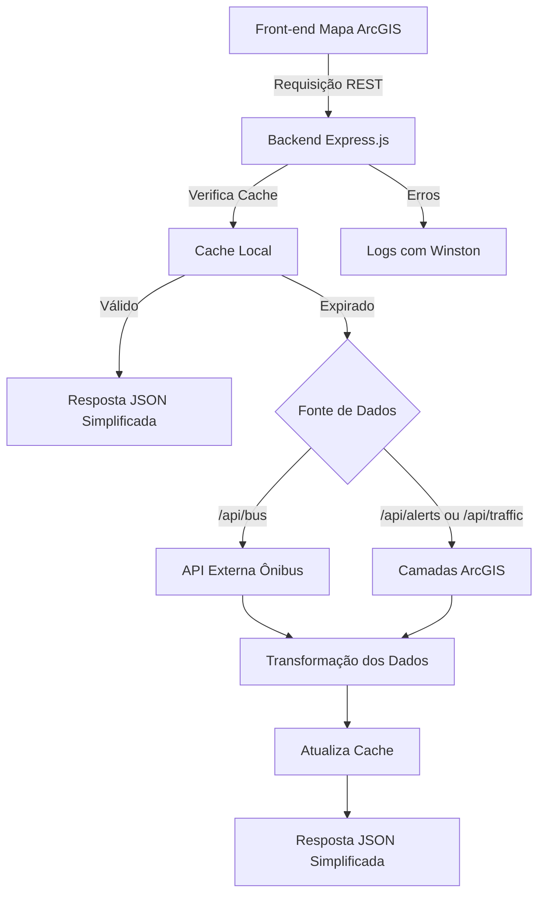

# Fluxo da Aplicação de Gêmeo Digital

Esta página documenta o fluxo de dados da aplicação de gêmeo digital, desde as fontes externas até a resposta ao front-end, detalhando os três endpoints principais: `/api/bus`, `/api/alerts` e `/api/traffic`.

---

## 📌 Visão Geral

A aplicação é composta por:

- Um front-end que renderiza um mapa interativo com ArcGIS.
- Um backend que serve informações geográficas e contextuais simplificadas por meio de uma API REST.

O foco do backend é sintetizar e padronizar os dados vindos de fontes diversas (APIs externas e camadas ArcGIS), aplicar cache para reduzir carga e latência, e registrar erros com Winston.

---

## 🔁 Fluxo Geral de Dados

1. O front-end realiza uma requisição para um dos três endpoints REST disponíveis.
2. O backend verifica se há um cache válido para aquela requisição.
3. Se o cache for válido, o backend responde diretamente com os dados em cache.
4. Caso contrário, ele consulta:
   - Uma **API externa** no caso de `/api/bus`
   - **Camadas ArcGIS próprias** no caso de `/api/alerts` e `/api/traffic`
5. Os dados brutos são então transformados:
   - Informações irrelevantes são descartadas
   - A estrutura do objeto é simplificada conforme o esperado pelo front-end
6. A resposta JSON é enviada ao front.
7. Qualquer erro encontrado é capturado por um middleware e registrado com **Winston** em arquivo de log.

---

## 📊 Diagrama de Fluxo

